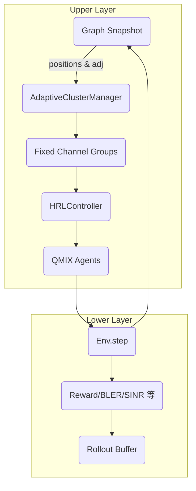

## MARL_QMIX 分层训练流程说明

### 1. 环境与场景
- **地图/节点**：`n_agents=16` 架 UAV，活动空间 `5km × 5km × 2km`，初始位置来自 `datasets/topologies/16_nodes/3d_2025-10-28-17-26-47/sample_xxx`，保证通信图连通。
- **通信拓扑**：`use_sparse_comm_topology=True`，同时强制 `comm_topology_require_connected/enforce_min_degree`，运行时会导出 `comm_adj.csv/comm_topology.png` 与 `run_args.json`。
- **帧结构**：`frame_slots=10`，episode 默认 50~100 步（T 秒）。每步包含：环境移动 -> 通信拓扑更新 -> 分簇 -> 行动执行 -> 干扰反馈。
- **干扰模型**：包含替代干扰 (`use_alt_jam_model=True` 的伯努利占用)、可选窄/宽带及 trace/linear_sweep；自定义参数 `jam_num=2、jam_sum_channel=10` 等。`jam_change_time=5` 表示每 5 ms 更新一次通道占用。

### 2. 智能体动作空间
- **组成**：`action = (channel_idx, RA_mode, Pt_level)`，其中 `FH_action=40` 个信道，`RA_action=5` 种调制编码，`Pt_action=3` 个功率档位，总计 `600` 个离散动作。
- **动作掩码**：在启用 HRL 时，`HRLController` 根据簇头/GAT 输出的 `group_assignments` 构造 `fixed_channel_groups`，仅允许 agent 在所属簇的信道集合中选择动作；若掩码导致无可选动作，会自动回退到全动作集。

### 3. 算法与模型流程

- **上层（UpperGraphAC）**  
  - 输入：每 `hrl_meta_period` 步收集的集中式观测 `obs`、簇头图邻接 `adj`（来自 `env.get_graph_snapshot`），以及簇内统计（`last_cluster_meta`）。  
  - 模型：`models/hierarchical/upper_graph_ac.py`，采用 G2ANet backbone，包含 actor/critic，支持优势归一化、熵退火。  
  - 输出：长度为 `n_agents` 的 `group_ids`（簇头决策），通过 `apply_to_controller` 写入 `HRLController`。  
  - 指标：`Upper/loss_pi`、`Upper/loss_v`、`Upper/A_mean`、`Upper/A_std`、`Upper/entropy`、`Upper/entropy_coef`。  
  - 更新：以 frame 为单位累计奖励，调用 `upper_ac.update()` 最多每 `upper_log_every` 次打印一次。

- **自适应分簇** (`controllers/hrl_controller.AdaptiveClusterManager`)  
  - 根据 `graph_snapshot.positions` 构造距离图，使用阈值 `hrl_cluster_radius_km` 找到连通分量，再按 `hrl_cluster_target_size` 对大分量拆分，自动生成簇数（不再固定为 3）。  
  - 缺乏图数据时回退到均匀划分；使用 `use_graph_obs=True` 可确保动态拓扑驱动分簇变化。  
  - 指标：`Cluster/train_step_avg_clusters`、`cluster_switch_ratio` 等。

- **下层（QMIX）**  
  - 输入：常规局部观测（15 维特征）和当前动作掩码。  
  - 模型：`policy/qmix.py` + `network/qmix_net.py`。  
  - 更新：每集采样后执行一次训练 (`train_steps=1`)，经验缓冲 `buffer_size=500`、`batch_size=64`。  
  - 指标：`Reward/BLER/Trans_rate/SINR_dB/Switch_ratio/Transmit_power/collision_ratio`。

### 4. 模型输入输出与时间线
- **输入**  
  - `env.get_state()`：`channel_num + 5 + 2*(nodes + jam_num)` 维，包含信道干扰、干扰类型 one-hot、节点坐标。  
  - `env.get_obs()`：每 agent 15 维，包括局部干扰水平、可用频段、历史信息等。  
  - `graph_snapshot`：结构体 `{positions(N×3), adjacency(N×N), threshold}`，供上层和分簇使用。
- **输出**  
  - 下层动作 `u_t`，经 `env.step` 返回 `(reward, BLER, trans_rate, switch_ratio, transmit_power, collision, sinr_avg, terminated)`。  
  - 上层输出的 `group_ids` 影响后续 `hrl_controller.get_action_mask()`。  
  - 结果写入 TensorBoard (`runs/`) 与 `result/eval_csvYYYY-mm-dd-hh-MM-ss/metrics.csv`。
- **更新时间点**  
  1. `env.reset()`：加载拓扑样本，构建图、稀疏邻居、簇信息。  
  2. 每步 `env.step()`：移动 UAV（若启用）、重建通信拓扑、刷新图快照、应用干扰。  
  3. 每 `hrl_cluster_refresh` 步：`AdaptiveClusterManager.update()` 重新划分簇并更新 channel groups。  
  4. 每 `hrl_meta_period`：上层 AC 采样一次决策。  
  5. 每 `evaluate_cycle`：`Runner.evaluate()`，输出评估指标与聚合簇指标。

### 5. 环境与干扰参数表
| 参数 | 默认值 | 说明 |
| --- | --- | --- |
| `space_box_km` | (5,5,2) | UAV 可活动区域 |
| `comm_range_km` | 1.0 | 通信邻居阈值，也用于分簇半径 |
| `jam_num` | 2 | 干扰机数量 |
| `jam_type` | narrow/comb/wide/linear_sweep/trace | 随机选择两种，每 `jam_change_time` 更新 |
| `use_alt_jam_model` | True | 额外伯努利占用模型，概率 `alt_jam_occ_prob=0.2` |
| `mobility_model` | gaussian | `mobility_sigma_km=0.05`，每步重建通信拓扑 |
| `use_graph_obs` | True（脚本中强制） | 生成图快照供上层决策与分簇 |

### 6. 训练运行
1. `python scripts/start_train_with_tb.py`  
   - 启动 TensorBoard (`runs/`)，再执行 `scripts/train_hierarchical.py`。  
   - 可用环境变量覆盖关键参数：`MQ_STEPS`、`MQ_EPISODE_LIMIT`、`MQ_TOPOLOGY_DIR` 等。
2. 训练过程中可在 TensorBoard 监控：  
   - `Reward/*`、`BLER/*`：下层性能。  
   - `Cluster/train_step_avg_clusters` 等：簇动态。  
   - `Upper/loss_pi` 等：上层训练质量。  
3. `result/eval_csv*/` 会保存每次评估的 CSV、当前拓扑图、运行参数 (`run_args.json`)，便于复现实验。
- **常用环境变量覆盖**（脚本已支持）：  
  - `MQ_STEPS` / `MQ_EPISODE_LIMIT` / `MQ_FRAME_SLOTS`：快速调整训练长度。  
  - `MQ_EPSILON` / `MQ_MIN_EPS` / `MQ_EPS_ANNEAL_STEPS`：修改 ε-greedy 退火曲线（默认 0.95→0.25 在 400k 步内完成）。  
  - `MQ_BATCH` / `MQ_BUFFER`：调节 batch size 与 replay buffer（默认 128 / 5000）。  
  - `MQ_CLUSTER_REFRESH`：自适应分簇的刷新周期（步）。  
  - `MQ_ALT_ENABLE` / `MQ_ALT_OCC`：是否启用替代干扰模型及其通道占用概率。  
  - `MQ_CLUSTER_DEBUG` / `MQ_CLUSTER_DEBUG_INT`：控制台打印簇划分调试信息（簇数、簇成员）。  
  - `MQ_LOCK_SAMPLE` / `MQ_SAMPLE_NAME`：映射至 `topology_dataset_lock_sample` 与 `topology_dataset_sample`，可在训练期间锁定某个 `sample_xxx` 拓扑实例。

### 7. 故障排查
- **Cluster 指标不变**：确认 `use_graph_obs=True`、`hrl_cluster_enable=True`、`mobility_model` 非 `none`，可适当减小 `hrl_cluster_refresh`。  
- **Upper 指标缺失**：仅在 `hrl_enable=True` 且 `upper_ac.update()` 执行后写入。若 `Upper/*` 全为零，检查 `upper_log_every` 是否过大或上层模式被设为 `local`。  
- **拓扑导出失败**：确保 `datasets/topologies/.../sample_xxx` 内存在 `comm_adj.csv` 等文件，并保持目录可写。

### 8. 新增工具
- `scripts/eval_topologies.py`：按目录遍历 `sample_xxx`，输出连通性、度分布等统计至 `result/topology_eval_*.csv`，便于挑选、加锁或审核拓扑数据集。
